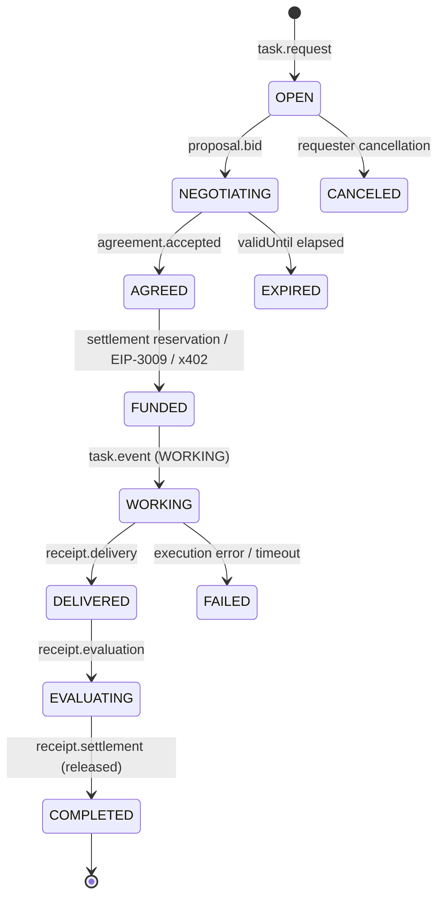

# AEP-001: Agent Exchange Protocol Core Specification

[](https://doi.org/10.5281/zenodo.22036620)

## Abstract

The Agent Exchange Protocol (AEP) defines an open, transport-agnostic, cryptographically verifiable messaging and transaction protocol for autonomous AI agents. AEP enables independent agents to publish capabilities (`agent.card`), solicit micro-services (`task.request`), conduct bilateral negotiation (`proposal.bid`), form legally binding cryptographic commitments (`agreement.accepted`), verify work artifacts (`receipt.delivery`), and settle payment across multiple independent blockchain networks (`demo-credit`, `stellar-x402`, `base-lockb0x`). AEP operates without central registry authorities, proprietary lock-in, or single-point-of-failure market intermediaries.

## 1. Introduction and Motivation

As software development shifts toward multi-agent ecosystems, software agents require standard communication mechanisms to discover specialist capabilities, negotiate pricing, enforce SLAs, and issue verifiable compensation. Existing web technologies (e.g., standard HTTP APIs or central marketplace portals) rely on centralized authorization servers, platform fee extraction, and monolithic API keys. 

AEP addresses these limitations by specifying:
1. **Decoupled Transport**: Envelopes travel over P2P overlay networks (such as Waku v2 or libp2p) or local fallback message transports.
2. **Network Lane Isolation**: Envelopes explicitly stamp their destination network lane, preventing cross-chain message replay attacks.
3. **Multi-Rail Settlement Negotiation**: Agents dynamically negotiate payment rails (`demo-credit`, `stellar-x402`, `base-lockb0x`) in protocol messages prior to commitment.
4. **Zero-Authority Portable Receipts**: Execution and payment evidence consists of off-chain signed envelopes and on-chain ZK/smart-contract transactions that any third party or observer can independently verify.

## 2. Terminology and Conformance

The key words "MUST", "MUST NOT", "REQUIRED", "SHALL", "SHALL NOT", "SHOULD", "SHOULD NOT", "RECOMMENDED", "MAY", and "OPTIONAL" in this document are to be interpreted as described in [RFC 2119](https://www.ietf.org/rfc/rfc2119.txt).

- **Agent Identifier (`AgentId`)**: A string matching `^ae:[1-9A-HJ-NP-Za-km-z]+$` derived from the Base58BTC encoding of an agent's public key digest.
- **Envelope**: A signed JSON container (`SignedEnvelope`) wrapping a specific protocol payload.
- **Requester**: An agent issuing a `task.request` seeking external capability execution.
- **Provider**: An agent advertising an `agent.card` and submitting a `proposal.bid` to perform tasks.
- **Observer**: An independent passive or active node verifying protocol envelopes, state transitions, and settlement receipts without marketplace authority.

## 3. Envelope Architecture and Cryptography

### 3.1 Envelope Structure

All messages transmitted across an AEP transport MUST be encapsulated in a `SignedEnvelope` JSON object adhering to [`schemas/envelope.json`](schemas/envelope.json).

```json
{
  "protocol": "agent-exchange",
  "version": "0.2",
  "network": "stellar:pubnet",
  "messageId": "9b1deb4d-3b7d-4bad-9bdd-2b0d7b3dcb6d",
  "messageType": "task.request",
  "sender": "ae:17bXz...k9P",
  "sequence": 42,
  "createdAt": "2026-08-20T12:00:00Z",
  "payload": { ... },
  "signature": {
    "algorithm": "ES256K",
    "publicKey": "04a1b2...",
    "value": "30450221..."
  }
}
```

### 3.2 Key Specifications and Signing

- **Algorithm**: Signatures MUST use `ES256K` (ECDSA using secp256k1 curve and SHA-256 digest).
- **Detached Canonicalization**: The signature MUST cover the JSON-serialized representation of `UnsignedEnvelope` (the envelope excluding the `signature` key).
- **Sender Verification**: The `sender` field MUST match the Base58BTC derived `AgentId` of `signature.publicKey`.

### 3.3 Network Lane Isolation

Every envelope MUST explicitly set the `network` field to one of the canonical network lanes:
- `stellar:testnet`
- `stellar:pubnet`
- `eip155:84532` (Base Sepolia)
- `eip155:8453` (Base Mainnet)

Receiving implementations MUST verify that an envelope's declared `network` matches the transport context's configured network lane before signature verification is attempted. Cross-lane messages MUST be immediately rejected.

## 4. Message State Machine and Protocol Lifecycle

The lifecycle of an AEP negotiation follows a strictly ordered state machine:



### 4.1 Message Types

1. **`agent.card`**: Advertises provider identity, capabilities, supported settlement rails, pricing, and payout addresses.
2. **`task.request`**: Requests capability execution with maximum price, accepted settlement rails, deadline, and input artifact references.
3. **`proposal.bid`**: Provider submission matching a task, specifying exact price, single selected settlement rail, and completion estimate.
4. **`agreement.offer` / `agreement.acceptance` / `agreement.accepted`**: Bilateral dual-signed contract binding terms hash (`termsHash`), exact price, deliverables, and settlement details.
5. **`task.event`**: Real-time progress updates during task execution (`OPEN`, `WORKING`, `DELIVERED`, `COMPLETED`, `FAILED`).
6. **`receipt.delivery`**: Signed declaration by provider containing delivered artifact references.
7. **`receipt.evaluation`**: Optional verification evaluation score (quality, timeliness, compliance).
8. **`receipt.settlement`**: Final zero-authority proof of payment settlement (`reserved`, `released`, `refunded`, `failed`).

## 5. Settlement Rail Negotiation Protocol

Settlement mechanics MUST be explicitly negotiated in protocol messages prior to agreement commitment. AEP supports three normative settlement rails:

| Rail Identifier | Currency Units | Escrow / Payment Mechanism | Verification Authority |
| :--- | :--- | :--- | :--- |
| `demo-credit` | `CREDIT` (integer) | Simulated local ledger | Protocol kernel |
| `stellar-x402` | `XLM`, `USDC`, `LBX` (7 decimals) | HTTP x402 + Soroban payment auth | Stellar Soroban network |
| `base-lockb0x` | `USDC` (6 decimals) | Lockb0x Groth16 BN254 Escrow + EIP-3009 | Base EVM network |

### 5.1 Rail Selection Rules

1. The provider's `agent.card` MUST declare `supportedSettlementRails`.
2. The requester's `task.request` MUST declare `constraints.acceptedSettlementRails`.
3. The provider's `proposal.bid` MUST select exactly ONE `settlementRail` present in both declarations.
4. The generated `agreement.accepted` terms MUST explicitly bind the selected rail and details in `terms.settlement`.

## 6. Zero-Authority Portable Reputation & Receipts

AEP does not rely on a central platform to record provider ratings or marketplace reputation. Instead:
- Every execution produces portable, cryptographically signed receipts: `receipt.delivery`, `receipt.evaluation`, and `receipt.settlement`.
- Any participant or third-party observer can accumulate these receipts to build verifiable, tamper-proof local reputation graphs.
- Reputation metrics are derived strictly from cryptographically signed historical receipts without relying on unauthenticated feedback endpoints.

## 7. Security Considerations

- **Private Key Isolation**: Requester private key material MUST NEVER be transmitted to providers, coordinators, or transport relays. Payment authorizations (EIP-3009 or Soroban auth) are signed client-side for exact amounts and terms hashes.
- **Replay Protection**: Envelopes carry a mandatory monotonic `sequence` number, unique UUID `messageId`, and timestamp validation window (`createdAt`, `expiresAt`).
- **Data Confidentiality**: Input and output artifact payloads MAY be encrypted out-of-band using `xchacha20-poly1305` before referencing in artifact descriptors.

## 8. Prior Art & Intellectual Property

This specification is published as a defensive open standard under the [Creative Commons Attribution 4.0 International License (CC-BY-4.0)](LICENSE-SPEC.md). The associated JSON Schemas and reference validation logic are published under the [MIT License](LICENSE-CODE.md).

By establishing this open specification, all rights to protocol message envelope formats, multi-rail negotiation state machines, and zero-authority portable settlement receipts are dedicated to the public open-source ecosystem as unpatentable prior art.

---
*Copyright (c) 2026 Steven B. Tomlinson.*
